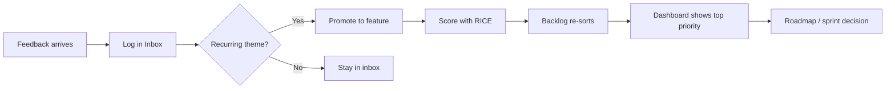

# 11 — Wireframes & User Flows

Visual reference for interviews. You can sketch these on a whiteboard from memory.

---

## Information architecture

```
FeedbackFlow
├── Dashboard    → summary metrics, source breakdown, how-to
├── Inbox        → add feedback, list, promote, delete
└── Backlog      → feature cards, RICE inputs, sorted list
```

---

## Screen 1 — Dashboard

```
┌────────────────────────────────────────────────────────┐
│ ◆ FeedbackFlow          [Dashboard] [Inbox] [Backlog]  │
├────────────────────────────────────────────────────────┤
│  Dashboard                                             │
│  At-a-glance view of feedback volume and top priority  │
│                                                        │
│  ┌──────────┐  ┌──────────┐  ┌──────────────────────┐│
│  │ Total    │  │ Feature  │  │ Top priority         ││
│  │ feedback │  │ ideas    │  │ Bulk CSV export      ││
│  │    6     │  │    3     │  │ RICE: 4.27           ││
│  └──────────┘  └──────────┘  └──────────────────────┘│
│                                                        │
│  Feedback by source                                    │
│  Support  ████████░░  3                                │
│  Sales    ██░░░░░░░░  1                                │
│  ...                                                   │
│                                                        │
│  How to use: Inbox → Promote → Backlog                 │
└────────────────────────────────────────────────────────┘
```

**PM talking point:** Dashboard answers "are we deciding or just collecting?" at a glance.

---

## Screen 2 — Inbox

```
┌────────────────────────────────────────────────────────┐
│  Add feedback                                          │
│  ┌──────────────────────────────────────────────────┐│
│  │ Users keep asking for bulk CSV export...           ││
│  └──────────────────────────────────────────────────┘│
│  Source: [Support ▼]    Submitter: [End user ▼]        │
│  [ Add to inbox ]                                      │
│                                                        │
│  Inbox (6)                                             │
│  ┌──────────────────────────────────────────────────┐│
│  │ SUPPORT · end-user              Jun 24, 2026     ││
│  │ Users keep asking for bulk CSV export...           ││
│  │ [Promote to feature]  [Delete]                     ││
│  └──────────────────────────────────────────────────┘│
│  ... more items ...                                    │
└────────────────────────────────────────────────────────┘
```

---

## Screen 3 — Backlog

```
┌────────────────────────────────────────────────────────┐
│  RICE = (Reach × Impact × Confidence) ÷ Effort           │
│                                                        │
│  ┌──────────────────────────────────────────────────┐│
│  │ #1 Bulk CSV export                          4.27  ││
│  │ Reach [8]  Impact [2 High]  Conf [80%]  Eff [3]  ││
│  │ Status: idea                        [Remove]       ││
│  └──────────────────────────────────────────────────┘│
│  ┌──────────────────────────────────────────────────┐│
│  │ #2 SSO (SAML)                             1.35  ││
│  │ ...                                              ││
│  └──────────────────────────────────────────────────┘│
└────────────────────────────────────────────────────────┘
```

---

## Core user flow (memorize)



---

## Edge cases you designed for

| Scenario | Behavior |
|----------|----------|
| Feedback < 10 chars | Validation blocks submit |
| Promote same feedback twice | Blocked — "already promoted" |
| Feature unscored | Appears at bottom of backlog |
| Delete feature | Unlinks feedback — can promote again |
| Empty inbox | Helpful empty state copy |
| First visit | Demo seed data for interview demo |

---

## Future flows (v1.1 — for roadmap discussion)

```
CSV file → Parse rows → Bulk add to inbox
Feature ← Link multiple feedback ids
Backlog → Export PDF → Email to stakeholder
```

Next: [`12-deployment-guide.md`](12-deployment-guide.md)
